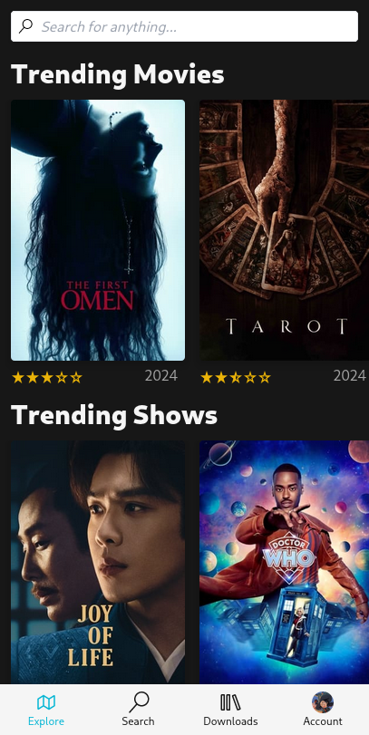
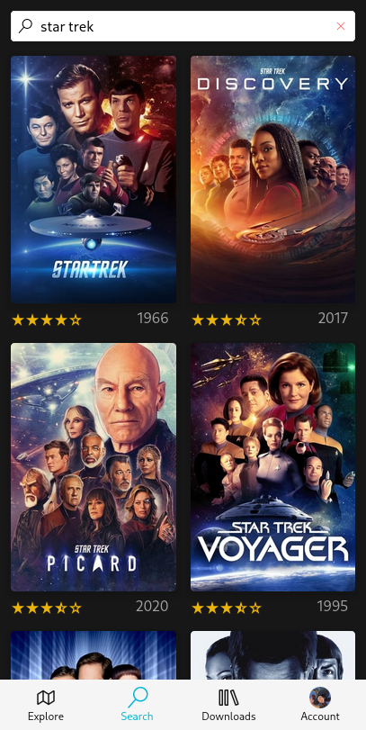
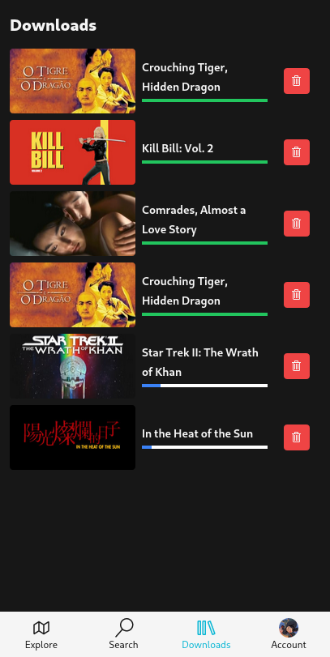
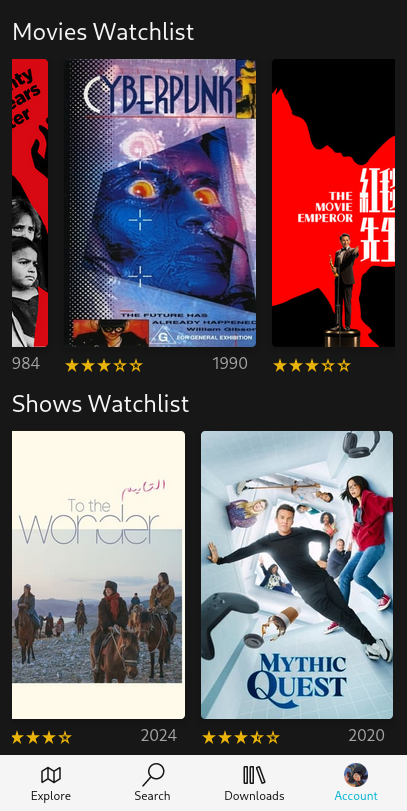
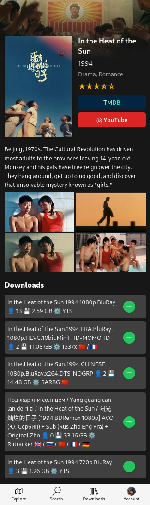

# VTrine

This is what I use to download movies. It basically fetches data from TMDB, queries the torrentio API for magnet links, and adds them to an instance of transmission 4.

The design is mobile-only, so it looks awful on desktop.

  
  
  
  
  

